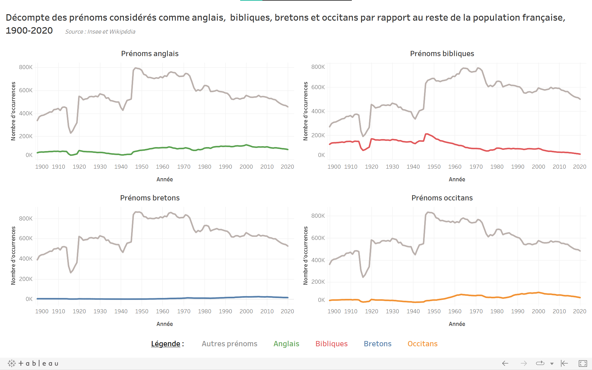
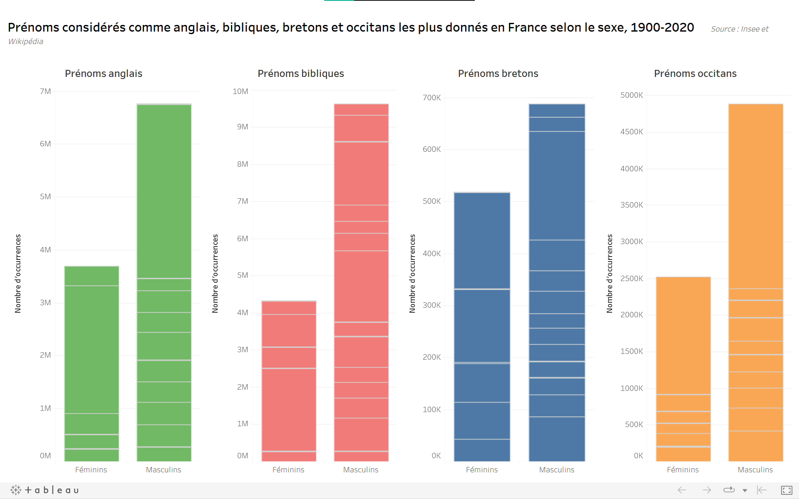
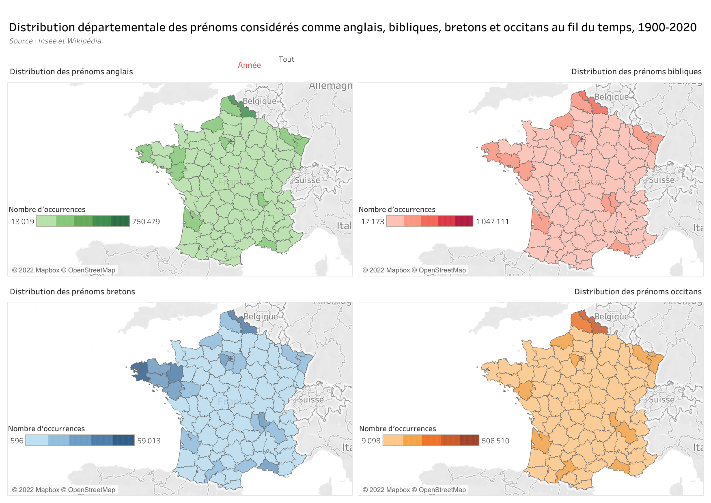
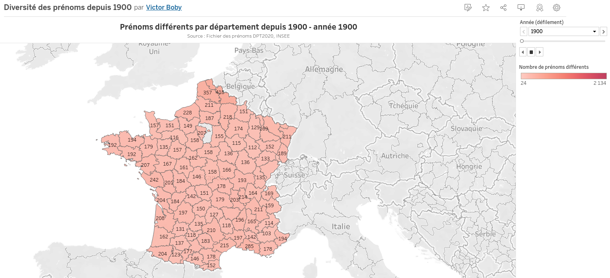
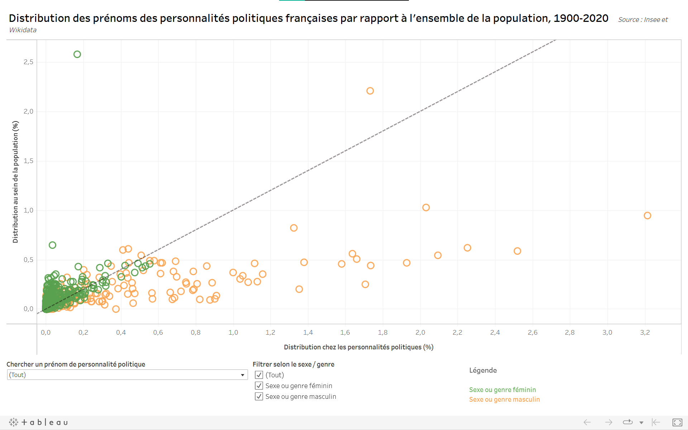

Data Visualisations | Les prénoms en France depuis 1900
===
### Victor Boby, Anaïs Mazoué, Ariane Menu - Avril 2022

Ce dépôt rend compte d'un projet réalisé dans le cadre du cours "Données, Web de données et exploitation" dispensé par Mme Lauryne Lemosquet et M. Axel Roche-Dioré au master 2 "Technologies numériques appliquées à l'histoire" de l'Ecole nationale des chartes.

> 🔴 **_N.B. :_  La description ci-dessous est un bref résumé des travaux réalisés dans le cadre du projet. La documentation complète peut être retrouvée dans le fichier `Compte_rendu.pdf`. 🔴**

# Objectif : enrichissement d'un dataset de prénoms

## Dataset primaire
Notre fichier de départ est le [Fichier des prénoms de l'INSEE](https://www.insee.fr/fr/statistiques/2540004?sommaire=4767262&q=pr%C3%A9noms), qui contient les prénoms attribués aux enfants nés en France hors Mayotte entre 1900 et 2020. À chaque prénom sont associés l'année d'attribution, le sexe de l'enfant et le nombre d'enfants ayant été ainsi nommés au cours d'une année. Les données sont disponibles à échelle nationale et départementale.

## Datasets secondaires
Les données initiales ont été complétées de deux façons :
- Avec les prénoms retrouvés sur la [liste des prénoms anglais](https://fr.wikipedia.org/wiki/Liste_de_pr%C3%A9noms_anglais), la [liste des personnages de la Bible](https://fr.wikipedia.org/wiki/Liste_des_personnages_de_la_Bible), la [liste des prénoms bretons](https://fr.wikipedia.org/wiki/Liste_de_pr%C3%A9noms_bretons) et la [liste des prénoms occitans](https://fr.wikipedia.org/wiki/Liste_de_pr%C3%A9noms_occitans) de Wikipédia.
- Avec les prénoms des personnalités politiques françaises nées depuis 1900 (requête SPARQL sur les données de [Wikidata](https://www.wikidata.org/wiki/Wikidata:Main_Page)).
- Nous avons écarté l'exploitation du fichier [Pantheon 2020 Person Dataset](https://pantheon.world/), un important dataset de données biographiques, du fait de l'absence de données historiques.

# DataViz

Vous pourrez retrouver nos DataViz ici :

- ## Décompte des prénoms considérés comme anglais, bibliques, bretons et occitans par rapport au reste de la population française, 1900-2020 [(voir la version interactive)](https://public.tableau.com/app/profile/am3015/viz/Dcomptedesprnomsconsidrscommeanglaisbibliquesbretonsetoccitansparrapportaurestedelapopulationfranaise1900-2020/decomptetotal)

- ## Prénoms considérés comme anglais, bibliques, bretons et occitans les plus donnés en France selon le sexe, 1900-2020 [(voir la version interactive)](https://public.tableau.com/app/profile/am3015/viz/PrnomsconsidrscommeanglaisbibliquesbretonsetoccitanslesplusdonnsenFranceselonlesexe1900-2020/GFTotal)

- ## Distribution départementale des prénoms considérés comme anglais, bibliques, bretons et occitans au fil du temps, 1900-2020 [(voir la version interactive)](https://public.tableau.com/app/profile/am3015/viz/Distributiondpartementaledesprnomsconsidrscommeanglaisbibliquesbretonsetoccitansaufildutemps1900-2020/geototal)

- ## Top 10 des prénoms les plus donnés par année depuis 1900 [(voir la version interactive)](https://public.tableau.com/app/profile/victor.boby/viz/Top10Prnomspardpartementetparanne/Feuille2#1)

- ## Evolution du nombre de prénoms par département depuis 1900 [(voir la version interactive)](https://public.tableau.com/app/profile/victor.boby/viz/Diversitdesprnomsdepuis1900/Prnomsdiffrentspardpartementdepuis1900)

- ## Distribution des prénoms des personnalités politiques françaises par rapport à l'ensemble de la population, 1900-2020 [(voir la version interactive)](https://public.tableau.com/app/profile/am3015/viz/Distributiondesprnomsdespersonnalitspolitiquesfranaisesparrapportlensembledelapopulation1900-2020/Politiques)

